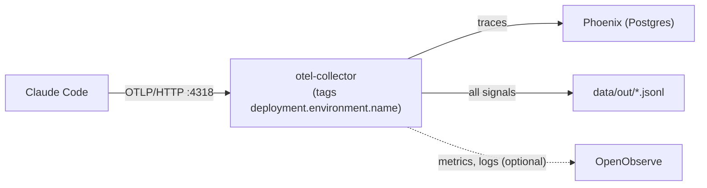

# claude-code-otel-local

A small, local observability stack for [Claude Code](https://code.claude.com/docs/en/monitoring-usage)'s built-in OpenTelemetry export. Claude Code sends traces, metrics and log events to a local OpenTelemetry collector. The collector tags every record with the environment it came from, writes everything to JSONL files, and forwards traces to [Phoenix](https://github.com/Arize-ai/phoenix). [OpenObserve](https://openobserve.ai) for metrics and log events is optional. It needs no vendor hook plugins, and Claude Code settings hold no credentials.



## Quickstart (about 5 minutes)

Needs Docker (with Compose v2), Python 3, GNU make and Claude Code.

On native Windows, run `make init` and `make up` from WSL or Git Bash: they need `bash`, `python3` and `id`, which PowerShell and `cmd` don't provide. Claude Code itself can keep running natively on Windows. See [docs/dual-environment.md](docs/dual-environment.md).

1. Create `.env` with generated secrets, then start the stack:
   ```bash
   make init    # writes .env (mode 600) and data/out; refuses to overwrite an existing .env
   make up      # preflight (secrets, overlays, free ports), then docker compose up -d
   ```
2. Merge the `env` block of [`examples/user-settings.json`](examples/user-settings.json) into the `env` block of your user settings, `~/.claude/settings.json` (Windows: `C:\Users\<user>\.claude\settings.json`).
3. Start a **new** Claude Code session. Settings are read once, at startup.
4. Open Phoenix at `http://localhost:6006` (or your `PHOENIX_PORT`). Traces appear under the `default` project; the JSONL copies are in `data/out/`.

`make logs` follows the collector; `make down` stops everything (data volumes are kept).

## Modes

| Mode | `.env` settings | Receivers | Sinks |
|---|---|---|---|
| Single (default) | `COLLECTOR_OVERLAY_1=none`, `COLLECTOR_OVERLAY_2=none` | `ENV_A_PORT` (4318), tagged `ENV_A_NAME` | Phoenix (traces), JSONL (all) |
| Dual environment | `COLLECTOR_OVERLAY_1=dual-env`, plus `ENV_A_NAME` / `ENV_B_NAME` | + `ENV_B_PORT` (4320), tagged `ENV_B_NAME` | same |
| + OpenObserve | one overlay slot `openobserve` **and** `COMPOSE_PROFILES=openobserve` | unchanged | + OpenObserve (metrics, log events) at `OPENOBSERVE_PORT` (5080) |

Modes combine: for example `COLLECTOR_OVERLAY_1=dual-env`, `COLLECTOR_OVERLAY_2=openobserve`, `COMPOSE_PROFILES=openobserve`. `make preflight` rejects an overlay without its profile, or the reverse. See [docs/dual-environment.md](docs/dual-environment.md) for running WSL and native Windows side by side.

## What you get

By default Claude Code redacts content. The launchers in [`launchers/`](launchers/) turn content capture on for one launch only.

| Kept with content off (the baseline) | Added by the content flags (launchers) |
|---|---|
| Span tree and timings: `interaction`, `llm_request`, `tool` (+ `blocked_on_user`, `execution`), `hook` (detailed tracing) | Prompt text: `user_prompt` on the interaction span and event |
| Model; input, output and cache tokens; cost; time to first token; stop reason | Response text: the `assistant_response` log event; plus `response.model_output` on the span with detailed tracing (headless only) |
| Built-in tool names, tool-use ids, prompt length | Tool inputs (paths, commands) and outputs (the `tool.output` span event) |
| Session id, `query_source` (parent vs subagent) | MCP tool names (otherwise `mcp_tool`) |

```bash
launchers/claude-traced.sh                     # interactive, content on
launchers/claude-traced.sh -p "prompt"         # headless
DETAILED=1 launchers/claude-traced.sh -p "…"   # + response text on spans
```

On Windows: `pwsh -File .\launchers\claude-traced.ps1 [-Detailed] [claude args]`.

## Privacy

- **Content capture copies whatever the session reads.** With the content flags on, prompts, replies, file contents, command output and tool arguments are stored in plain text, including any secrets the agent reads. They land in `data/out/*.jsonl`, in Phoenix's database and, if enabled, in OpenObserve. Use the launchers only for sessions whose content you are willing to keep.
- **Some identifiers always ship**, whatever the flags: `user.email`, account ids and `organization.id` are resource attributes on every signal.
- Everything stays on this machine. All ports bind to `127.0.0.1`. See [SECURITY.md](SECURITY.md).

## Verify

| Command | Tier | Needs | Checks |
|---|---|---|---|
| `make verify` | 1 + 3 | Python (uv), Docker | Offline config, env, example, launcher and public-readiness checks; then, for each of the 4 overlay combinations, an isolated stack that receives a synthetic span, log and metric and routes them with the right tags |
| `make verify-settings` | 2 | your settings files | Your user settings match the baseline (`CLAUDE_SETTINGS_A`, default `~/.claude/settings.json`; optional `CLAUDE_SETTINGS_B` for a second environment). Prints key names only |
| `make verify-claude` | 4 | Claude Code + subscription, Docker | Real `claude -p` runs: settings precedence, content capture, detailed tracing; the launcher into an isolated stack → prompt in Phoenix and OpenObserve |

## Documentation

- [docs/concepts.md](docs/concepts.md): settings scopes and precedence, signal routing, content flags, interactive vs headless.
- [docs/findings.md](docs/findings.md): observed Claude Code behaviour, with the version and the test that re-checks it.
- [docs/dual-environment.md](docs/dual-environment.md): WSL and Windows on one Docker engine.
- [docs/pipelines.md](docs/pipelines.md): guidance for `claude -p` workers.
- [docs/phoenix.md](docs/phoenix.md): what Phoenix shows for each span, the collector's OpenInference mapping, and querying by REST, GraphQL or MCP.
- [SECURITY.md](SECURITY.md), [CHANGELOG.md](CHANGELOG.md).

## Design

- [docs/design/2026-09-27-claude-code-otel-local-design.md](docs/design/2026-09-27-claude-code-otel-local-design.md): the design spec (scope, components, configuration, test tiers, release sequence).
- [docs/design/2026-09-27-claude-code-otel-local-v1.md](docs/design/2026-09-27-claude-code-otel-local-v1.md): the v1 implementation plan, with an "As built" section where the build deliberately differs.

## Disclaimer

Not affiliated with or endorsed by Anthropic, Arize or OpenObserve. The findings are version-specific observations of Claude Code 2.1.283, not documented guarantees.

## License

[MIT](LICENSE)
