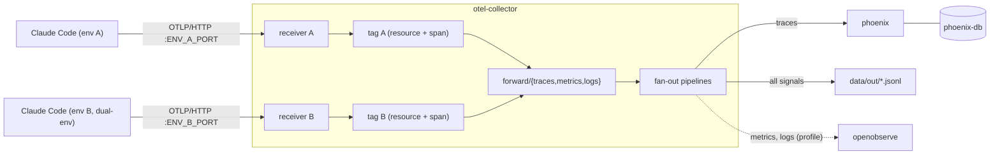

# claude-code-otel-local: Design

- **Date:** 2026-09-27
- **Status:** implemented in v0.1.0. Where the build deliberately differs from this design, the plan's "As built" section says so: [2026-09-27-claude-code-otel-local-v1.md](2026-09-27-claude-code-otel-local-v1.md#as-built-v010).
- **Repo:** `claude-code-otel-local` on GitHub, **public from first push**, MIT license.
- **Origin:** extracted from an earlier validation project, where this setup was tested on WSL and native Windows. It replaces a heavier local observability stack for telemetry-only needs.

## 1. Purpose and scope

A small, local, **native-only** observability stack for Claude Code's built-in OpenTelemetry export. It works without vendor hook plugins and without credentials in Claude Code settings.

**Success criteria:**
1. A new user goes from clone to a first Claude Code trace in Phoenix in about 5 minutes, following the README, on any OS with Docker.
2. The owner's two-environment setup (WSL + native Windows on one Docker Desktop engine) runs from the same repo through configuration only.
3. Every documented behavior has a test tier that re-checks it (§5).
4. The repo contains no personal data (email, usernames, personal paths, session IDs, tokens), enforced by a test.

**In scope (v1):**
- An OTel collector with one or two receivers and environment tagging.
- JSONL file capture of all signals.
- Phoenix (Postgres-backed) for traces.
- Optional OpenObserve for metrics and logs.
- Per-launch content launchers (bash, PowerShell).
- Example settings files.
- Four test tiers, and docs.

**Out of scope (v1):**
- A `gen_ai.*` semantic-convention mapping (wait for semconv-genai PR #498 to merge).
- The Arize `claude-code-otlp-collector` bridge (it needs raw API body files on disk).
- Langfuse and hook plugins.
- CI that invokes `claude -p` (needs a subscription).
- Verified macOS/Linux runs (expected to work; documented as unverified).
- Hosting unrelated MCP servers that ran in the previous, heavier local observability stack.

## 2. Components and data flow

| Component | Image (pinned) | Role | Default |
|---|---|---|---|
| `otel-collector` | `otel/opentelemetry-collector-contrib:0.140.0` | Receives OTLP/HTTP; tags the environment; writes JSONL; forwards traces to Phoenix | yes |
| `phoenix` | `arizephoenix/phoenix@sha256:e61b2ec06fa1f2f96fb9ffbdf55a7484290931188f82b05393def69b85eeaba2` (19.13.0) | Trace UI and store | yes |
| `phoenix-db` | `postgres:16.15-alpine` (digest-pinned) | Phoenix storage; internal network only | yes |
| `openobserve` | pinned tag, chosen during implementation | Metrics and log-event UI and store | Compose profile `openobserve` |

**Rules:**
- **Claude Code talks only to the collector.** User settings hold one generic `OTEL_EXPORTER_OTLP_ENDPOINT`, with no per-signal endpoints and no headers.
- **The collector tags every record** with `deployment.environment.name`, as a resource attribute **and** on every span. Phoenix discards resource attributes; this was verified.
- **JSONL capture is always on.** It's the audit copy, and the only home of interactive `assistant_response` text when OpenObserve is off.
- **One Compose network.** The collector addresses `phoenix:6006` and `openobserve:5080` by service name.
- **All host ports bind to `127.0.0.1`.**
- **Content capture is a launch-time choice** (the launchers). There is no content filtering in the collector.

## 3. Configuration

### 3.1 `.env` (from `.env.example`, gitignored)

| Key | Default | Dual-env example | Purpose |
|---|---|---|---|
| `ENV_A_NAME` | `local` | `wsl` | Tag for receiver A |
| `ENV_A_PORT` | `4318` | `4318` | Host port, receiver A |
| `ENV_B_NAME` | `windows` | `windows` | Tag for receiver B (dual-env only) |
| `ENV_B_PORT` | `4320` | `4320` | Host port, receiver B (always published; nothing listens without the overlay) |
| `COLLECTOR_OVERLAY_1` | `none` | `dual-env` | First overlay slot |
| `COLLECTOR_OVERLAY_2` | `none` | `openobserve` | Second overlay slot |
| `PHOENIX_PORT` | `6006` | `6007` | Host port, Phoenix |
| `PHOENIX_RETENTION_DAYS` | `14` | `14` | `PHOENIX_DEFAULT_RETENTION_POLICY_DAYS` |
| `PHOENIX_DB_PASSWORD` | generated | generated | Internal Postgres password |
| `OPENOBSERVE_PORT` | `5080` | `5080` | Host port (profile only) |
| `OPENOBSERVE_ROOT_EMAIL` | `admin@example.com` | your choice | OpenObserve root user |
| `OPENOBSERVE_ROOT_PASSWORD` | generated | generated | OpenObserve root password |
| `OPENOBSERVE_BASIC_AUTH` | derived | derived | Collector → OpenObserve `Authorization: Basic` token |
| `OPENOBSERVE_RETENTION_DAYS` | `30` | `30` | `ZO_COMPACT_DATA_RETENTION_DAYS` |

`scripts/init-env.sh` writes `.env` with random passwords and the derived token. It refuses to overwrite an existing `.env`.

### 3.2 Collector overlays

The collector merges repeated `--config` files; **lists are replaced, not appended**. Environment pipelines therefore end in `forward` connectors, and one fan-out pipeline per signal owns the sink lists.

| File | Defines | Edits existing lists |
|---|---|---|
| `collector/base.yaml` | `otlp/a` receiver (`0.0.0.0:4318`), `resource/a` + `attributes/a` tag processors, `forward/traces\|metrics\|logs`, `file/*` + `otlphttp/phoenix` exporters, `batch`; pipelines `traces/a`, `metrics/a`, `logs/a` → forward, plus fan-out pipelines `traces/out` → [file, phoenix], `metrics/out` → [file], `logs/out` → [file] | — |
| `collector/dual-env.yaml` | `otlp/b` receiver (`0.0.0.0:4320`), `resource/b` + `attributes/b`; pipelines `traces/b`, `metrics/b`, `logs/b` → forward | none |
| `collector/openobserve.yaml` | `otlphttp/openobserve` exporter (header from `${env:OPENOBSERVE_BASIC_AUTH}`); redefines `metrics/out` and `logs/out` exporters as [file, openobserve] | fan-out lists only |
| `collector/none.yaml` | `{}` | — |

Compose runs the collector with `--config=/etc/otelcol/base.yaml --config=/etc/otelcol/${COLLECTOR_OVERLAY_1:-none}.yaml --config=/etc/otelcol/${COLLECTOR_OVERLAY_2:-none}.yaml`. The image has no shell, hence the fixed slots.

**Gate (first implementation tasks):** confirm on 0.140 that (a) repeated `--config` merges maps as described and (b) the `forward` connector is available. If either fails, fall back to a config rendered by `scripts/render-collector.py` from `.env` flags.

### 3.3 Examples (`examples/`)

- **`user-settings.json`:** the native baseline `env` block: `CLAUDE_CODE_ENABLE_TELEMETRY=1`, `CLAUDE_CODE_ENHANCED_TELEMETRY_BETA=1`, `OTEL_{TRACES,METRICS,LOGS}_EXPORTER=otlp`, `OTEL_EXPORTER_OTLP_PROTOCOL=http/protobuf`, `OTEL_EXPORTER_OTLP_ENDPOINT=http://localhost:4318`.
  - The README notes the dual-env variant (`:4320` on the second OS) and that user settings override the shell for the same key.
- **`project-settings.local.json`:** `deniedMcpServers` entries for claude.ai connectors (`{"serverName": "claude.ai Gmail"}`), and the telemetry-off form (`OTEL_*_EXPORTER=none`).

### 3.4 Launchers (`launchers/`)

`claude-traced.sh` and `claude-traced.ps1` set `OTEL_LOG_USER_PROMPTS`, `OTEL_LOG_ASSISTANT_RESPONSES`, `OTEL_LOG_TOOL_DETAILS` and `OTEL_LOG_TOOL_CONTENT` for one launch.
- `-Detailed` / `DETAILED=1` adds `ENABLE_BETA_TRACING_DETAILED=1` and `BETA_TRACING_ENDPOINT`, taken from `OTEL_EXPORTER_OTLP_ENDPOINT` if set, else `http://localhost:4318`.
- The PowerShell launcher passes arguments through via `$args` and restores prior variable values on exit.

## 4. Behavior the repo documents (evidence carried over from the earlier validation project)

Each is written up in `docs/findings.md`, pinned to Claude Code 2.1.283, and re-checked by a tier-4 test:
1. **Precedence.** User `settings.json` `env` beats the inherited process env for the same key. The process env applies only to keys user settings leave unset. `--settings <file>` overrides both.
2. **Project scope.** Project `.claude/settings*.json` cannot enable telemetry; it can only set it to off.
3. **Response on spans.** In headless `-p`, detailed tracing puts `response.model_output` on `claude_code.llm_request`. Interactive sessions don't: that needs org allowlisting, and how to get it isn't documented.
4. **Where content lands.** The prompt goes on the `interaction` span; tool output in a `tool.output` span event; the reply in the `assistant_response` log event.
5. **Skills.** Skills emit a `skill_activated` event and `skill.name`-labelled cost and token metrics. `OTEL_LOG_TOOL_DETAILS=1` adds `skill_name` to the tool span.
6. **Subagents** nest under the parent's `Agent` tool span in one trace. `query_source` separates parent calls from subagent calls.
7. **Context noise** is dominated by MCP tool definitions. `--strict-mcp-config --disable-slash-commands` cut cache-creation tokens from 547,782 to 4,247 on one task. `deniedMcpServers` blocks claude.ai connectors per project.
8. **Phoenix accepts traces only.** `/v1/logs` and `/v1/metrics` return 405 on 19.13.0 and 20.16.0.

## 5. Testing

| Tier | Needs | Checks | Runs in |
|---|---|---|---|
| 1 Offline | Python | The pipeline graph is valid for all 4 overlay combinations (every referenced component defined; each pipeline has ≥1 receiver and ≥1 exporter). `.env.example` covers every `${VAR}`. Example JSON is valid and has the baseline. `bash -n` on the launchers (plus a PowerShell parse check when `pwsh` exists). **Public-readiness scrub**: no emails, `/home/<user>`, `C:\Users\<user>`, UUID session IDs or token patterns; the report shows file and line only | CI + local |
| 2 Settings hygiene | the user's Claude Code settings | Ported from the earlier validation project. Environments come from `CLAUDE_SETTINGS_A` / optional `CLAUDE_SETTINGS_B`, with no personal defaults. Negative cases run against committed, sanitized fixtures | local |
| 3 Docker smoke | Docker | For each overlay combination: `otelcol validate`; `compose up` under an isolated project name with random ports; send one synthetic span, log and metric per active receiver (`opentelemetry-sdk` + OTLP HTTP exporter); assert the JSONL is tagged correctly, Phoenix has the span with the tag as a **span attribute**, and, with the profile on, OpenObserve `_search` returns the log; tear down | CI + local |
| 4 Claude CLI (`RUN_CLAUDE_CLI=1`) | Claude Code + subscription | The four precedence and capture tests; `claude -p` through a launcher → Phoenix span with prompt text; `user_prompt` in OpenObserve with the profile on | local |

**Rules:**
- No secrets in any output: settings tests print key names only.
- Tier 3 needs no Claude account.
- Entry points: `make verify` (tiers 1 + 3), `make verify-settings` (2), `make verify-claude` (4).
- **CI:** GitHub Actions on `ubuntu-24.04` (pinned, not `ubuntu-latest`) runs tiers 1 and 3, and is available because the repo is public.

## 6. Docs

- **`README.md`:** what it is; a 5-minute quickstart; a modes table (single, dual-env, + OpenObserve); a kept-vs-content-flags table; a privacy warning (content capture copies whatever sessions read, including secrets).
- **`docs/concepts.md`:** scopes and precedence, content flags, interactive vs headless, signal routing.
- **`docs/findings.md`:** §4 with dates, versions and the test that re-checks each item.
- **`docs/dual-environment.md`:** WSL + Windows on one Docker engine, the Windows launcher, Remote Control for cross-session messaging.
- **`docs/pipelines.md`:** guidance for `claude -p` workers: per-call keys only, minimal-context flags, never `--bare`, `TRACEPARENT` / `OTEL_RESOURCE_ATTRIBUTES` set per call.
- **`CHANGELOG.md`, `SECURITY.md`** (localhost binding, content-capture storage, reporting), **`LICENSE`** (MIT).
- **Disclaimer:** not affiliated with Anthropic, Arize or OpenObserve. Findings are version-specific observations.

## 7. Release sequence (public from the first push)

1. Implement locally on a feature branch in `~/claude-code-otel-local`. Tiers 1 and 3 green; the scrub test green.
2. **Owner runs `/code-review ultra`** on the local branch. It needs no GitHub remote; one run on the finished v1 branch.
3. Fix the findings; re-run tiers 1–3.
4. Create the **public** GitHub repo `claude-code-otel-local` and push `main`. CI runs tiers 1 and 3.

## 8. Migrating from an existing local collector

For a user who already runs a local OTel collector and Phoenix for Claude Code:

1. With tiers 1 and 3 green, stop the old collector and Phoenix. Start this stack with the **same host ports** (for example 4318, and 4320 for a second environment), so Claude Code settings don't change.
2. Phoenix starts fresh. Keep the old Phoenix database volume until the migration is confirmed.
3. Verify on real settings: tier 2, tier 4 and, in dual-environment setups, a session from the second environment whose spans arrive with its tag.
4. Point any downstream projects or docs that referenced the old stack at this repo. Refresh copied launchers (for example a Windows copy under `C:\Users\<user>\.claude\scripts\`).
5. Remove the old stack's volume only after confirming nothing is missing.

## 9. Risks

| Risk | Mitigation |
|---|---|
| Collector config merge or `forward` connector behaves differently from assumed | Gate tasks in §3.2; fallback renderer |
| Claude Code beta tracing changes names or behavior | Findings pinned to version; tier 4 re-checks; CHANGELOG notes the tested version |
| Personal data leaks into a public repo | Tier-1 scrub test; owner's ultra review before the first push; sanitized fixtures only |
| Users enable content capture and store secrets | README privacy warning; content only via explicit launchers; files gitignored |
| Port conflicts with other local stacks | All ports configurable; tier 3 uses random ports |
